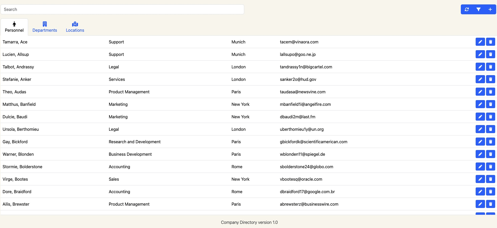
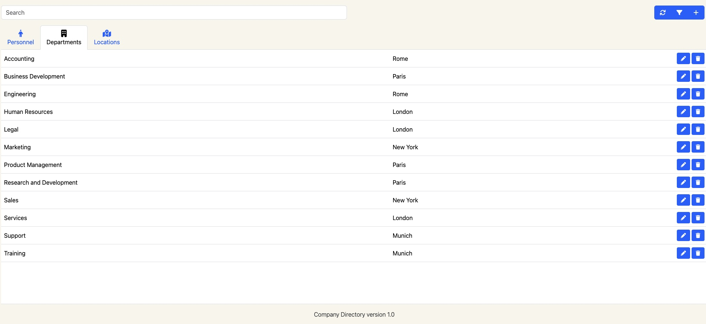
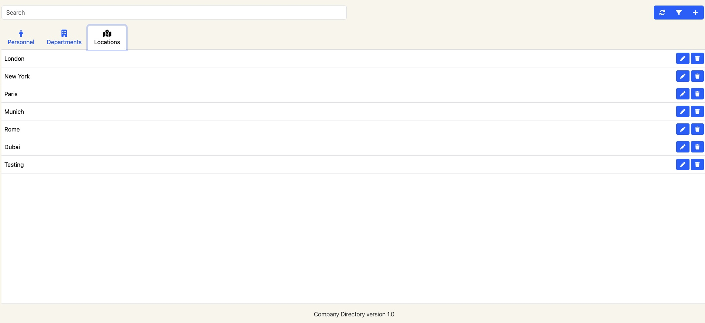
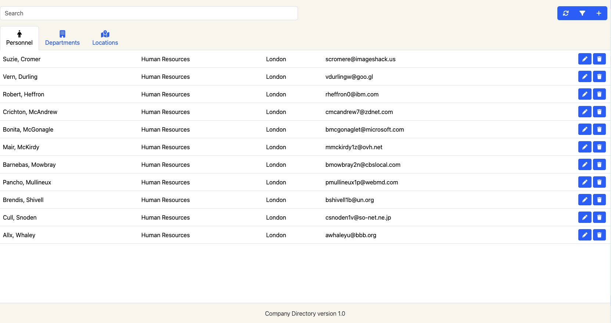

## Company directory

The Company Directory is a web-based application designed to manage and display contact information for employees within an organization. Developed using HTML, CSS, Bootstrap, jQuery, PHP, and Font Awesome, this application provides a user-friendly interface for accessing and managing employee details such as names, job titles, email address, department and location.

### Features

- User-Friendly Interface: Easy navigation and interaction with the company directory.
- Responsive Design: Built with Bootstrap for a responsive layout that adapts to different screen sizes and devices.
- Dynamic Data Management: Create, read, update, and delete (CRUD) operations on employee records using PHP and jQuery.
- Refresh, Search and Filter: Refresh and quickly find employees by name, department, or location.
- Data Visualization: Personnel, departments and locations are displayed in structured formats.

### Usage

- Clone this repository to your local machine.
- Ensure you have a web server with PHP installed.
- Host the application on your web server.
- Set Up the Database: Import the provided SQL file into your MySQL database to set up the required tables.
- Configure Database Connection: Open the config.php file in the libs/php directory. Update the database connection parameters to match your environment (database name, username, password, host, etc.).
- Launch the Application: Open your web browser and navigate to the directory where you have deployed the application.

### Tools and Technologies

- Front-End: HTML, CSS, Bootstrap, jQuery, Font Awesome
- Back-End: PHP
- Database: MySQL

### Credits

- Icons provided by Font Awesome.
